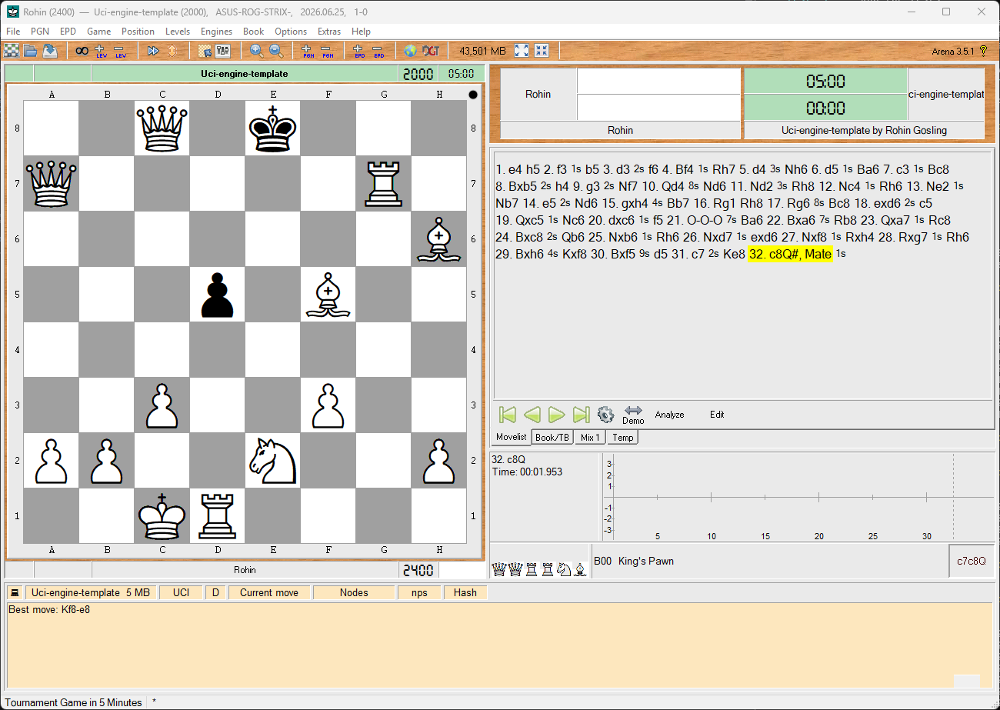

# UCI Chess Engine Template - Rust

[](https://www.rust-lang.org/)
[](https://doc.rust-lang.org/cargo/)
[](https://www.shredderchess.com/chess-info/features/uci-universal-chess-interface.html)

<div align="center">
  
</div>

<br>

A minimal UCI-compliant chess engine, written in Rust.

This reference engine is intentionally simple: it reads UCI commands, maintains a legal chess position with `cozy-chess`, and replies to the UCI `go` command by choosing a random legal move. The goal is not chess strength; the goal is a small, readable structure that shows how Arena and other chess GUIs communicate with a command-line engine.

The move-selection layer is replaceable. Future selectors can add classical search, heuristics, neural-network inference, or other experiments behind the same `MoveSelector` trait.

<a id="table-of-contents"></a>

## 📋 Table of Contents

- [✅ Requirements](#requirements)
- [⚙️ Setup](#setup)
- [▶️ Running](#running)
- [♟️ Manual UCI Smoke Test](#manual-uci-smoke-test)
- [🧩 Arena Installation](#arena-installation)
- [🧠 Engine Behavior](#engine-behavior)
- [🗂️ Project Layout](#project-layout)
- [🔌 Extension Point](#extension-point)
- [⚠️ Template Limitations](#template-limitations)
- [📄 License](#license)

<br>

<a id="requirements"></a>

## ✅ Requirements

- Rust stable
- Cargo
- A UCI-compatible chess GUI such as Arena, Cute Chess, BanksiaGUI, or another GUI for manual testing

The project has no GUI, network service, async runtime, opening book, or GPL dependency in the default template.

<br>

<a id="setup"></a>

## ⚙️ Setup

From the project root, build the release binary:

```powershell
cargo build --release
```

The Windows executable is created at:

```text
target/release/uci-engine-template.exe
```

Run the automated tests:

```powershell
cargo test
```

Run the linter with warnings denied:

```powershell
cargo clippy -- -D warnings
```

<br>

<a id="running"></a>

## ▶️ Running

Run the debug build directly:

```powershell
cargo run
```

Run the release executable after building:

```powershell
.\target\release\uci-engine-template.exe
```

The engine starts silently and waits for UCI commands on standard input. It does not print a banner or prompt.

<br>

<a id="manual-uci-smoke-test"></a>

## ♟️ Manual UCI Smoke Test

After starting the engine, type:

```text
uci
isready
position startpos
go movetime 1000
quit
```

Expected response shape:

```text
id name UCI Engine Template Rust
id author Rohin Gosling
uciok
readyok
bestmove <legal-uci-move>
```

When the current position has no legal moves, the engine returns the UCI null move:

```text
bestmove 0000
```

<br>

<a id="arena-installation"></a>

## 🧩 Arena Installation

1. Build the release binary with `cargo build --release`.
2. Open Arena.
3. Install a new engine.
4. Select `target\release\uci-engine-template.exe`.
5. Choose UCI if Arena asks for the engine protocol.
6. Start a game or analysis session.

Arena launches the executable as a command-line process. Commands flow into the engine through standard input, and UCI protocol responses flow back through standard output.

<br>

<a id="engine-behavior"></a>

## 🧠 Engine Behavior

The current implementation supports the core commands needed by Arena and other UCI-compatible GUIs.

| Command | Behavior |
|---|---|
| `uci` | Prints engine identity and `uciok` |
| `isready` | Prints `readyok` |
| `ucinewgame` | Resets the session to the starting position |
| `position startpos` | Sets the board to the standard starting position |
| `position startpos moves ...` | Sets the start position and applies each UCI move |
| `position fen ...` | Sets the board from FEN |
| `position fen ... moves ...` | Sets the FEN position and applies each UCI move |
| `go ...` | Starts move selection and prints one random legal `bestmove` |
| `stop` | Recognized no-op for the instant random selector |
| `debug on`, `debug off` | Toggles diagnostic logging to standard error |
| `setoption ...` | Recognized and ignored for now |
| `quit` | Exits cleanly |

Standard output is reserved for protocol messages such as `uciok`, `readyok`, and `bestmove`. Diagnostics and debug messages go to standard error so chess GUIs never try to parse logs as protocol text.

Invalid `position` commands are rejected as a whole. The previous valid position is retained, and a diagnostic is written to standard error.

<br>

<a id="project-layout"></a>

## 🗂️ Project Layout

```text
project-root/
├─ Cargo.toml
├─ Cargo.lock
├─ LICENSE
├─ README.md
├─ rustfmt.toml
├─ docs/
│  ├─ architecture.md
│  └─ spec.md
├─ src/
│  ├─ main.rs
│  ├─ lib.rs
│  ├─ board/
│  │  ├─ mod.rs
│  │  └─ position.rs
│  ├─ engine/
│  │  ├─ mod.rs
│  │  ├─ random.rs
│  │  ├─ selector.rs
│  │  └─ session.rs
│  ├─ search/
│  │  ├─ limits.rs
│  │  └─ mod.rs
│  └─ uci/
│     ├─ command.rs
│     ├─ driver.rs
│     ├─ mod.rs
│     ├─ parser.rs
│     └─ response.rs
└─ tests/
   ├─ uci_go.rs
   ├─ uci_handshake.rs
   └─ uci_position.rs
```

<br>

<a id="extension-point"></a>

## 🔌 Extension Point

Move choice is controlled by the `MoveSelector` trait:

```rust
pub trait MoveSelector {
    fn select_move(
        &mut self,
        position: &crate::board::position::Position,
        limits: &crate::search::limits::SearchLimits,
    ) -> Option<cozy_chess::Move>;
}
```

`RandomMoveSelector` is the first concrete implementation. Future selectors can replace it without changing the UCI driver, because the driver asks the `EngineSession` for a move rather than depending on a specific search algorithm.

Possible future selectors include material-only heuristics, minimax, alpha-beta search, Monte Carlo tree search, neural-network inference, or experimental entropy-based move selection.

<br>

<a id="template-limitations"></a>

## ⚠️ Template Limitations

- The engine chooses random legal moves and does not evaluate positions.
- `stop` is a no-op because move selection is immediate.
- `setoption` is recognized but no configurable engine options are exposed yet.
- Time controls are parsed into `SearchLimits`, but the random selector ignores them.
- There is no opening book, tablebase support, pondering, multithreading, or GUI.

<br>

<a id="license"></a>

## 📄 License

Released under the [MIT License](LICENSE) — Copyright © 2024 Rohin Gosling.
