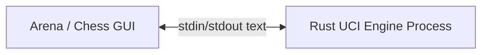
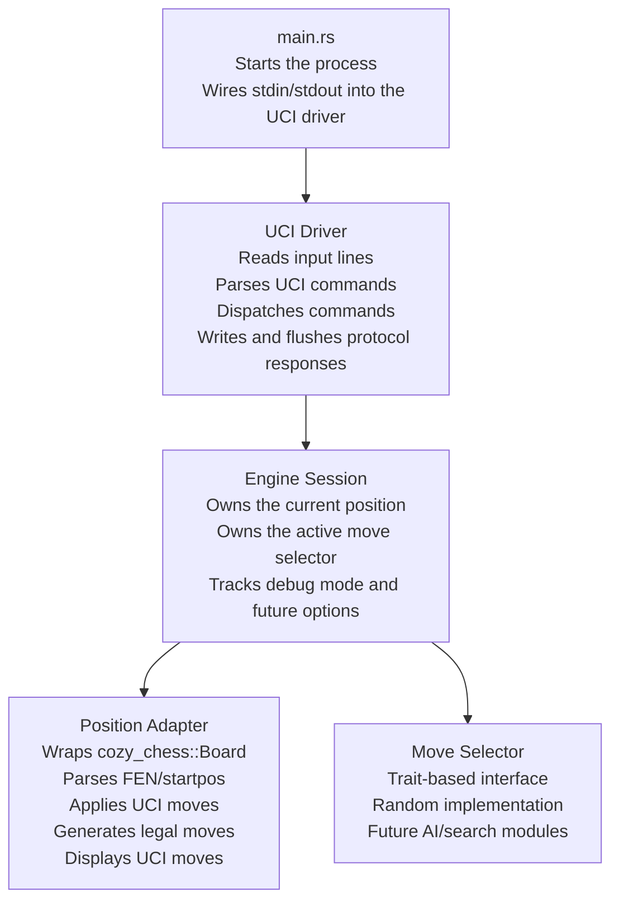
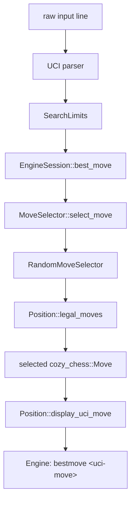
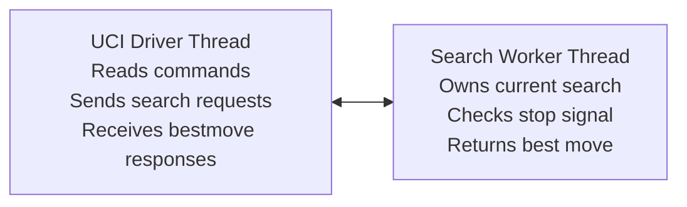
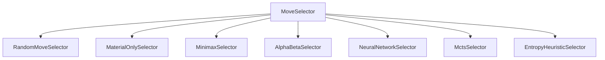

# Architecture: Rust Random UCI Chess Engine Template

## Table of Contents

- [1. Purpose](#1-purpose)
- [2. Repository boundary](#2-repository-boundary)
- [3. Architectural goals](#3-architectural-goals)
- [4. Non-goals for the first version](#4-non-goals-for-the-first-version)
- [5. System context](#5-system-context)
- [6. High-level component diagram](#6-high-level-component-diagram)
- [7. Proposed module layout](#7-proposed-module-layout)
- [8. Component responsibilities](#8-component-responsibilities)
- [9. Command flow](#9-command-flow)
- [10. Error handling strategy](#10-error-handling-strategy)
- [11. Logging and diagnostics](#11-logging-and-diagnostics)
- [12. Threading model](#12-threading-model)
- [13. Testing architecture](#13-testing-architecture)
- [14. Arena integration](#14-arena-integration)
- [15. Future extension points](#15-future-extension-points)
- [16. Release architecture](#16-release-architecture)

## 1. Purpose

This project is a minimal Rust template for building UCI-compatible chess engines.

The first reference engine plays random legal moves. Its purpose is not to play strong chess. Its purpose is to demonstrate the core program structure of a UCI engine that can be loaded by Arena or another UCI-compatible chess GUI.

The architecture should make the random move module replaceable. Future move-selection logic could be a classical search algorithm, a neural network, a symbolic heuristic, an entropy-based heuristic, or another experimental decision model.

## 2. Repository boundary

The repository root is the Rust project root. It should contain the Rust project's `Cargo.toml`, `src/`, tests, docs, and build configuration.

Expected project root:

```text
project-root/
├─ Cargo.toml
├─ README.md
├─ docs/
├─ src/
└─ tests/
```

## 3. Architectural goals

The architecture has four main goals:

- Keep the UCI protocol layer separate from chess rules.
- Keep chess board state separate from move-selection logic.
- Provide a small, stable move-selection interface that can be implemented by many future engines.
- Keep the first implementation easy to understand, test, and run in Arena.

## 4. Non-goals for the first version

The first version does not attempt to provide:

- strong chess play;
- evaluation functions;
- alpha-beta search;
- neural-network inference;
- opening books;
- endgame tablebases;
- pondering;
- multithreaded search;
- time-management sophistication;
- PGN import/export;
- a graphical user interface.

Those can be added later behind the same architectural seams.

## 5. System context

A UCI chess engine is a command-line process. The chess GUI launches the engine executable, writes commands to the engine's standard input, and reads responses from the engine's standard output.



The engine must treat standard output as protocol-only. Diagnostics, debug logs, and development traces must go to standard error or to a file, never to standard output.

## 6. High-level component diagram



## 7. Proposed module layout

```text
project-root/
├─ src/
│  ├─ main.rs
│  ├─ lib.rs
│  ├─ board/
│  │  ├─ mod.rs
│  │  └─ position.rs
│  ├─ engine/
│  │  ├─ mod.rs
│  │  ├─ random.rs
│  │  ├─ selector.rs
│  │  └─ session.rs
│  ├─ search/
│  │  ├─ limits.rs
│  │  └─ mod.rs
│  └─ uci/
│     ├─ command.rs
│     ├─ driver.rs
│     ├─ mod.rs
│     ├─ parser.rs
│     └─ response.rs
└─ tests/
   ├─ uci_go.rs
   ├─ uci_handshake.rs
   └─ uci_position.rs
```

## 8. Component responsibilities

### 8.1 `main.rs`

`main.rs` should be deliberately thin.

Responsibilities:

- create stdin/stdout handles;
- call the UCI driver;
- return an appropriate process exit code.

It should not contain chess rules, move-selection logic, or detailed UCI parsing.

### 8.2 `uci::driver`

The UCI driver is the front controller for the engine process.

Responsibilities:

- read lines from standard input;
- trim and normalize input;
- pass each line to the parser;
- dispatch parsed commands;
- write UCI-compliant responses;
- flush standard output;
- exit on `quit`.

The driver should be forgiving. Unknown or malformed commands should not crash the engine. In debug mode they may be logged to standard error.

### 8.3 `uci::parser`

The parser converts raw text into a project-specific command enum.

Example command enum shape:

```rust
pub enum UciCommand {
    Uci,
    IsReady,
    UciNewGame,
    Position(PositionCommand),
    Go(SearchLimits),
    Stop,
    Debug(bool),
    SetOption { name: String, value: Option<String> },
    Quit,
    Unknown(String),
}
```

The parser should be permissive enough for real GUIs. It should not assume that Arena will only send commands used by the first random engine.

### 8.4 `uci::response`

The response module centralizes UCI output formatting.

Responsibilities:

- engine identity lines;
- `uciok`;
- `readyok`;
- `bestmove <move>`;
- future `info ...` lines;
- future `option ...` lines.

Centralizing response formatting reduces the risk of protocol typos spread through the codebase.

### 8.5 `engine::session`

The engine session owns the mutable state of a single engine process.

Responsibilities:

- current board position;
- active move selector;
- debug flag;
- future options;
- handling `ucinewgame`;
- handling `position ...`;
- handling `go ...`.

The session should expose a small API to the UCI driver, such as:

```rust
pub struct EngineSession<S: MoveSelector> {
    position: Position,
    selector: S,
    debug: bool,
}

impl<S: MoveSelector> EngineSession<S> {
    pub fn new(selector: S) -> Self;
    pub fn new_game(&mut self);
    pub fn set_position(&mut self, command: PositionCommand) -> Result<(), EngineError>;
    pub fn best_move(&mut self, limits: &SearchLimits) -> Option<cozy_chess::Move>;
}
```

### 8.6 `engine::selector`

The selector module defines the abstraction for choosing a move.

The key trait should be intentionally small:

```rust
pub trait MoveSelector {
    fn select_move(
        &mut self,
        position: &Position,
        limits: &SearchLimits,
    ) -> Option<cozy_chess::Move>;
}
```

This is the main extension point for future engines.

### 8.7 `engine::random`

The random selector is the first implementation of `MoveSelector`.

Responsibilities:

- ask the position for legal moves;
- return `None` if no legal move exists;
- otherwise choose one legal move uniformly or approximately uniformly at random.

It should not know about UCI input/output.

### 8.8 `board::position`

The position adapter wraps the external chess library.

Responsibilities:

- create a start position;
- parse FEN;
- apply UCI moves;
- generate legal moves;
- display internal moves as public UCI move strings;
- hide library-specific details from the rest of the engine.

This adapter is important because chess libraries often have internal move representations that do not exactly match public UCI text, especially for castling and Chess960-related details.

### 8.9 `search::limits`

`SearchLimits` represents the parameters supplied by the UCI `go` command.

Fields should include, at least:

- `wtime`;
- `btime`;
- `winc`;
- `binc`;
- `movetime`;
- `depth`;
- `nodes`;
- `infinite`;
- `searchmoves`.

The first random selector can ignore these fields. Keeping the struct now prevents the protocol layer from being redesigned later when real search is added.

## 9. Command flow

### 9.1 UCI handshake

```text
GUI:    uci
Engine: id name Random Rust UCI Engine
Engine: id author Rohin Gosling
Engine: uciok

GUI:    isready
Engine: readyok
```

### 9.2 New game

```text
GUI: ucinewgame
GUI: isready
Engine: readyok
```

`ucinewgame` should reset game-specific state. In the first version this likely means resetting the board to the starting position and clearing any future search state.

### 9.3 Position setup

```text
GUI: position startpos moves e2e4 e7e5
```

Flow:

```mermaid
flowchart TD
    input["raw input line"] --> parser["UCI parser"]
    parser --> command["PositionCommand"]
    command --> session["EngineSession::set_position"]
    session --> startpos["Position::startpos"]
    startpos --> first_move["Position::apply_uci_move(\"e2e4\")"]
    first_move --> second_move["Position::apply_uci_move(\"e7e5\")"]
```

### 9.4 Move selection

```text
GUI: go movetime 1000
```

Flow:



## 10. Error handling strategy

The engine should avoid panics at the UCI boundary.

Recommended behavior:

- Unknown command: ignore, optionally log to stderr in debug mode.
- Invalid FEN: log to stderr, keep previous position or reset to start position; document the chosen behavior.
- Illegal move in `position ... moves`: log to stderr and stop applying further moves; document the chosen behavior.
- No legal moves on `go`: return `bestmove 0000`.
- I/O error on stdin/stdout: exit cleanly if possible.

The first version should favor robustness over strict rejection.

## 11. Logging and diagnostics

Standard output is reserved for UCI protocol messages.

Allowed on stdout:

```text
id name ...
id author ...
uciok
readyok
bestmove ...
info ...
option ...
```

Diagnostics should go to standard error:

```text
eprintln!("debug: received unknown command: {line}");
```

This rule matters because GUIs parse stdout as protocol text. Stray logs can make the engine appear broken.

## 12. Threading model

The first version should be single-threaded.

This is acceptable because random move selection is effectively immediate. A future search engine may need a worker thread so that the engine can respond to `stop` while searching.

Future threaded design:



Do not add that complexity until a real search module needs it.

## 13. Testing architecture

Use three levels of testing.

### 13.1 Unit tests

Unit-test pure parsing and formatting code:

- `uci` parses as `UciCommand::Uci`;
- `isready` parses as `UciCommand::IsReady`;
- `go movetime 1000` parses expected limits;
- `position startpos moves e2e4` parses expected position command.

### 13.2 Module tests

Test the position adapter:

- start position has legal moves;
- legal UCI moves can be applied;
- illegal UCI moves return an error;
- display of selected moves is UCI-compatible.

### 13.3 Integration tests

Spawn the engine binary and communicate over stdin/stdout:

- UCI handshake;
- readiness check;
- start position plus `go`;
- position with a move list plus `go`;
- no-legal-move position does not hang.

Integration tests should not assert one exact random move unless the position has only one legal move.

## 14. Arena integration

Arena launches the engine executable and communicates through UCI.

Local workflow:

```powershell
cargo build --release
```

Then install the binary in Arena as a UCI engine:

```text
target/release/uci-engine-template.exe
```

Before using Arena, smoke-test manually in a terminal:

```text
uci
isready
position startpos
go movetime 1000
quit
```

Expected response shape:

```text
id name Random Rust UCI Engine
id author Rohin Gosling
uciok
readyok
bestmove <legal-move>
```

## 15. Future extension points

The main future extension point is `MoveSelector`.

Possible implementations:



A future selector should not need to know about Arena, stdin, stdout, or UCI command parsing. It should receive a position and search limits, then return a move.

## 16. Release architecture

For GitHub releases, the project should eventually provide:

- source code in the Cargo project root;
- a Windows x86_64 release binary for Arena users;
- release notes;
- basic installation instructions;
- checksum files if the release process matures.

The first release should prioritize the Windows Arena workflow. Linux and macOS builds can be added later once the engine is stable and tested with GUIs on those platforms.
